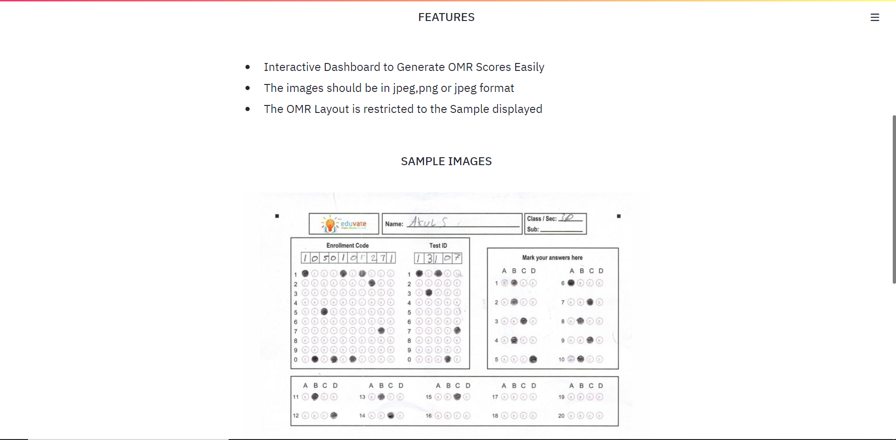
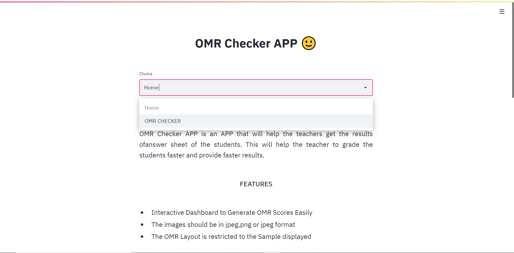
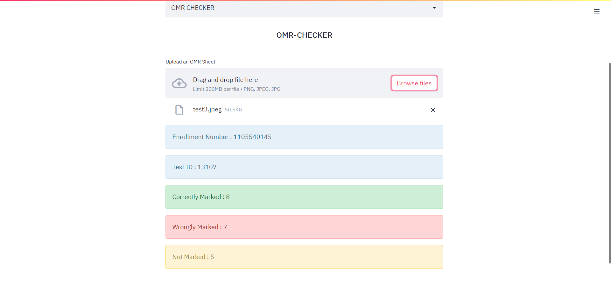

# OMR-Checker-DEMO

## Description
- OMR Checker APP is an APP that will help the teachers get the results ofanswer sheet of the students. This will help the teacher to grade the students faster and provide faster results.

## Tools Used
- Python 3.7
- OpenCV
- Streamlit
- Pillow

## Screenshots of APP







## How to run the App

- Install python3 from <a href="https://www.python.org/downloads/">here</a> and add python to path
- Open CMD( or bash) and type :
```shell
pip install -r requirements.txt
```
