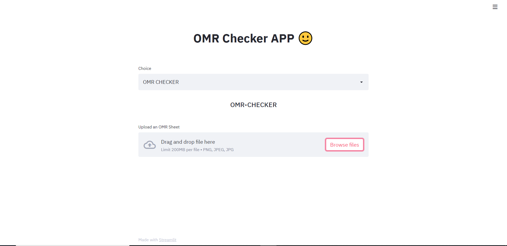

# OMR-Checker-DEMO

## Description
- OMR Checker APP is an APP that will help the teachers get the results ofanswer sheet of the students. This will help the teacher to grade the students faster and provide faster results.

## Tools Used
- Python 3.7
- OpenCV
- Streamlit
- Pillow

## Screenshots of APP





## How to run the App

- Install python3 from <a href="https://www.python.org/downloads/">here</a> and add python to path
- Clone this repo in your local machine using the command
```shell
git clone https://github.com/N-A-C-S/OMR-Checker-Demo.git
```
- Traverse into the project directory
```shell
cd OMR-Checker-Demo
```
- Install required libraries
```shell
pip install requirements.txt
```
- Run the app
```
streamlit run main.py
```

## Demo


## Contributing to the project
- Clone the Repo
```shell
git clone https://github.com/N-A-C-S/OMR-Checker-Demo.git
```
- Move into the repo
```shell
cd OMR-Checker-Demo
```
- Create a new branch
```shell
git branch <your feature>
git checkout <your feature>
```
- Now write some code and create a pull request 🙂


<h3 align="center">Made by NACS</h3>
           
<p align="center">
  
</p>

<h5 align="center"><a href="https://github.com/N-A-C-S/OMR-Checker-Demo/blob/main/LICENSE">license</a></h5>
